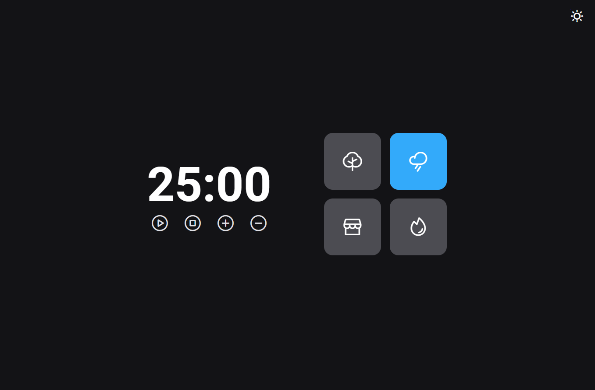

<h1 align="center">

Timer Pomodoro

</h1>

## 🚀 Tecnologias

- HTML
- CSS
- JavaScript

## 💻 Projeto

 Esse projeto é baseado na técnica de um timer pomodoro, com isso utilizei javaScript puro para dar vida a suas funções. 
 O projeto possui sons ambientes que auxilia a manter o foco e relaxar a mente, botões que controlam e adiciona tempo ao timer além de um botão para ativar Dark e Light mode.

## 💪Desafio feito por

| Luan Reis | 🙅‍♂️

- [LinkedIn](https://www.linkedin.com/in/lreiss7)
---
